# The Committee Deliberation as a Palgebra Pipeline

## Motivation

The adversarial committee workflow — `/committee` followed by `/review`, with optional remediation loops — is the most developed pipeline in this repository. It has a concrete directory-based output format (`<situation-dir>/deliberations/` for live runs, with checked-in examples under `examples/deliberations/`), a fixed cast of characters, structured phases, evaluation rubrics, and a feedback loop. Yet until now it has been described only procedurally (the skill files) and by example (the `is-author-crackpot` record). This document gives it a palgebra treatment: resource equations that specify the pipeline as a composition of typed operations on decorated texts, with the same formal status as the AI study pipeline in `palgebra/decorated-texts.md`.

The payoff is threefold. First, the equations make explicit what the skill files leave implicit — which operations are transformations and which are enrichments, where confidence can degrade, and where human gates collapse graded uncertainty into crisp decisions. Second, the equations are mechanically convertible to string diagrams via the `/string-diagram` skill, giving a visual topology of the whole workflow. Third, framing the committee as a palgebra pipeline connects it to the broader formalism: committees become composable building blocks that could wire into larger pipelines (e.g., feeding a committee resolution into an evidence-gathering stage, or using committee output as input to a trade study).

## The artifact types

Every named type below corresponds to a file in the deliberation record directory. The types are soft types in the palgebra sense — each is a `(template, rubric)` pair where the template defines structural shape and the rubric defines quality criteria evaluated by LLM scoring. Artifacts inhabit these types to a degree.

| Type name | File | Template (structural shape) | Rubric (quality criteria) |
|-----------|------|-----------------------------|---------------------------|
| `problem-statement` | (user input) | Natural-language description of a complex, ambiguous problem | Has genuine competing framings; is not a lookup question |
| `charter` | `00-charter.md` | YAML front matter with goal, context, success\_criteria, exit\_conditions, deliverable\_format | Goal is falsifiable; success criteria are specific; context is sufficient for outsiders |
| `roster` | `01-roster.md` | YAML front matter with five fixed members (Maya, Frankie, Joe, Vic, Tammy), roles, propensities | All five failure modes covered; natural tensions present |
| `convening` | `01-convening.md` | Markdown narrative: selection rationale, composition notes, remediation parameters | Rationale explains why this problem needs this roster; parameters are justified |
| `transcript` | `02-deliberation.md` | Markdown with Opening Statements, Initial Positions, Key Tensions, Rounds, Final Consensus, Decision Space Map | Five rubric dimensions (see below) |
| `resolution` | `03-resolution.md` | YAML front matter with outcome, decision, summary, probability distribution, votes, signatures | Addresses charter success criteria; votes are individually reasoned |
| `evaluation` | `04-evaluation-1.md` | YAML front matter with rubric\_scores (5 dimensions, 0-3 each), aggregate, verdict, gaps, recommendations | Citations are specific; scores match cited evidence; gaps are actionable |
| `remediation` | `05-remediation-1.md` | Markdown point-by-point response to evaluation, plus new debate round appended to transcript | Every cited gap addressed; new material is substantive, not cosmetic |

The five transcript rubric dimensions — reasoning completeness, adversarial rigor, assumption surfacing, evidence standards, trade-off explicitness — are themselves the rubric component of the `transcript` soft type. The evaluation skill applies this rubric to produce scores, making the review operation an enrichment in the precise palgebra sense.

## The catalytic inputs

Several inputs participate in operations without being consumed. In the string diagram these appear as dashed wires; in the equations they are marked `{catalytic: ...}`.

| Catalytic input | What it is | Used by |
|-----------------|------------|---------|
| `character-propensities` | The fixed character reference (`artifacts/character-propensity-reference.md`) | Convene, Deliberate |
| `roberts-rules` | Robert's Rules forcing function (procedural constraints) | Deliberate |
| `evaluation-rubrics` | The five-rubric scoring guide (`artifacts/evaluation-rubrics-reference.md`) | Evaluate |
| `remediation-threshold` | Numeric threshold (default: sum < 13 of 15) | Gate |

These are comonoid objects in the categorical sense — they can be copied
and fed into multiple operations without being altered or depleted. In the
Markov category framework ([categorical-structures.md, §2a](categorical-structures.md)),
the copy map is part of the defining structure: every object carries a
commutative comonoid, and catalytic inputs are precisely the objects where
this copy map is exercised.

## Resource equations

```
# ── Phase 0: Charter ─────────────────────────────────────────────
# The user's problem statement is transformed into a structured charter.
# This is a transformation morphism: the input is consumed and a new
# artifact with different structure is produced.

problem-statement → charter  [DraftCharter]


# ── Phase 1: Convening ───────────────────────────────────────────
# The charter, combined with the character propensities reference,
# produces both a roster and a convening narrative. The propensities
# are catalytic — they shape the output but are not consumed.
# The roster is always the same five characters, but the convening
# narrative explains *why* this problem activates their particular
# tensions. Two outputs: structured roster + narrative rationale.

charter × character-propensities → roster + convening  [Convene]  {catalytic: character-propensities}


# ── Phase 2: Deliberation ────────────────────────────────────────
# The core transformation. Charter (what we're debating), roster
# (who is debating), convening (why these people, what parameters),
# character propensities (how each character behaves), and Robert's
# Rules (procedural forcing function) are all consumed or consulted
# to produce a transcript. This is the heaviest morphism in the
# pipeline — it generates the bulk of the narrative content.
#
# Character propensities and Robert's Rules are catalytic: they
# constrain generation without being altered. The charter, roster,
# and convening are genuinely consumed (their information is folded
# into the transcript but the transcript is a different artifact).

charter × roster × convening × character-propensities × roberts-rules → transcript  [Deliberate]  {catalytic: character-propensities, roberts-rules}


# ── Phase 3: Resolution ──────────────────────────────────────────
# The transcript is distilled into a structured resolution: outcome,
# decision, votes, probability distribution. The charter is catalytic
# here — it provides the success criteria against which the resolution
# must be assessed, but it isn't consumed. The transcript is consumed
# (its narrative is compressed into structured YAML).

transcript × charter → resolution  [Resolve]  {catalytic: charter}


# ── Phase 4: Evaluation ──────────────────────────────────────────
# Independent review. The transcript is scored against the five
# rubrics. This is an ENRICHMENT morphism: the transcript's content
# is not altered; only metadata (scores, verdict, gaps) is produced.
# The evaluation rubrics and the charter are catalytic — they guide
# scoring but are unchanged.
#
# The output is a separate evaluation artifact rather than front-matter
# on the transcript, but the palgebra semantics are the same: the
# operation reads the transcript, produces scores, and the transcript
# itself is unmodified. The evaluation artifact is the "Δmeta" that
# would be joined to the transcript's metadata in a front-matter
# implementation.

transcript × evaluation-rubrics × charter → evaluation  [Evaluate]  {catalytic: evaluation-rubrics, charter}


# ── Phase 5: Quality Gate ────────────────────────────────────────
# The evaluation's aggregate score is compared against the
# remediation threshold. This is a coproduct: the evaluation is
# sorted into "passed" (score ≥ threshold) or "needs-remediation"
# (score < threshold). The threshold is catalytic. The "passed"
# stream flows to the human gate; the "needs-remediation" stream
# flows to the remediation loop.
#
# This is the pipeline's internal quality control — an automated
# check before the human gate.

evaluation × remediation-threshold → passed-evaluation + needs-remediation  [QualityGate]  {catalytic: remediation-threshold}


# ── Phase 5a: Remediation (conditional) ──────────────────────────
# When the gate routes to needs-remediation, the committee reconvenes.
# The evaluation's cited gaps become the agenda. The original transcript
# and character propensities are consulted. The output is a remediation
# document (point-by-point responses + new debate round) and an
# amended transcript with new material appended.
#
# This is a transformation: the old transcript is consumed and a new,
# extended transcript is produced.

needs-remediation × transcript × character-propensities → remediation + transcript  [Remediate]  {catalytic: character-propensities}


# ── Phase 5b: Re-evaluation (feedback) ───────────────────────────
# The amended transcript is re-evaluated. This closes the feedback
# loop: Remediate → Evaluate → QualityGate → (Remediate | pass).
# Maximum 2 remediation rounds by default.
#
# Formally this is a traced monoidal structure: the wire from
# Remediate's transcript output feeds back to Evaluate's transcript
# input. The trace is bounded (max 2 iterations), making it a
# finite unrolling of the trace rather than an unbounded fixed-point
# computation.

transcript → evaluation  [Evaluate]  {feedback: transcript→transcript}


# ── Phase 6: Human Gate ──────────────────────────────────────────
# The collapse operator. All graded uncertainty (scores, confidence
# bands, probability distributions, cited gaps) is presented to the
# human editor. The human decides: accept the resolution, request
# changes, or reject.
#
# This is not expressible as a standard morphism — it is a gate
# that terminates the pipeline's recursive self-assessment in a
# crisp commitment. Before the gate: potential (graded quality).
# After the gate: decision (binary commitment).
#
# In second-order cybernetic terms, this is where the observer
# (the human) enters the system and collapses the eigenform.

passed-evaluation × resolution → accepted-resolution + rejected-resolution  [HumanGate]  {discard: rejected-resolution}
```



## Reading the equations

### Nine operations, four structural kinds

The pipeline contains nine named operations spanning the four structural kinds identified in the palgebra formalism:

**Transformations** (new content produced, inputs consumed):
- `DraftCharter`: problem statement → structured charter
- `Convene`: charter → roster + convening narrative
- `Deliberate`: all inputs → transcript (the heaviest morphism)
- `Resolve`: transcript → structured resolution
- `Remediate`: evaluation gaps + transcript → amended transcript + remediation record

**Enrichment** (content unchanged, metadata produced):
- `Evaluate`: transcript → evaluation scores, verdict, gaps

The evaluation is the clearest enrichment in the pipeline. The transcript's payload is read but not modified. The evaluation artifact carries the "Δmeta" — scores, citations, gaps, recommendations — that in a front-matter implementation would be joined to the transcript's metadata via the `⊔` operator. That the evaluation is stored as a separate YAML file rather than as front-matter on the transcript is an implementation choice; the palgebra semantics are identical either way.

**Coproduct with threshold** (sorting into streams):
- `QualityGate`: evaluation → passed + needs-remediation

The quality gate is a threshold check on the evaluation's aggregate score: sum of five rubric scores ≥ 13 (default) routes to "passed"; below routes to "needs-remediation." This is the coproduct — dual to the cross product — with the remediation threshold as a catalytic input that parameterizes the sort.

**Collapse** (graded uncertainty → crisp commitment):
- `HumanGate`: passed evaluation + resolution → accept or reject

The human gate is the pipeline's termination point. It collapses the graded quality assessment (evaluation scores, confidence bands, cited gaps) into a binary decision. In second-order cybernetic terms, this is where the observer enters the system. In palgebra terms, it is a gate morphism: `(text, meta) ↦ proceed | halt`. The pipeline's recursive self-assessment cannot continue past this point without human intervention.

### Catalytic inputs: what shapes without being shaped

Five catalytic inputs thread through the pipeline:

- **character-propensities** feeds into `Convene`, `Deliberate`, and `Remediate`. It is the fixed reference that ensures character consistency across operations and across deliberations. Its catalytic status means it accumulates no provenance from any particular run — it is a shared resource, not a per-run artifact.

- **roberts-rules** feeds into `Deliberate` as a procedural forcing function. It constrains the form of debate (motions, seconds, points of order) without being altered by the debate's content.

- **evaluation-rubrics** feeds into `Evaluate`. The five rubric dimensions (reasoning completeness, adversarial rigor, assumption surfacing, evidence standards, trade-off explicitness) are the rubric component of the transcript's soft type. The evaluation operation *applies* this rubric to produce scores.

- **remediation-threshold** feeds into `QualityGate`. It parameterizes the coproduct: what score constitutes "good enough"? The default is 13/15. The convening document can override this for deliberations that warrant different standards.

- **charter** appears as catalytic input to both `Resolve` and `Evaluate`. The resolution must address the charter's success criteria; the evaluation must assess whether the deliberation fulfilled the charter's goals. But the charter itself is unchanged by either operation.

### The feedback loop

The remediation cycle — `Evaluate → QualityGate → Remediate → Evaluate → ...` — is formally a traced monoidal structure. The trace is the wire from `Remediate`'s transcript output back to `Evaluate`'s transcript input. Each traversal of the loop:

1. Produces a new evaluation file (chronology index increments: 04 → 06 → 08)
2. Produces a new remediation file (05 → 07)
3. Appends material to the transcript

The trace is bounded: maximum 2 remediation rounds by default. This makes it a finite unrolling rather than an unbounded fixed-point computation. The bound is itself a parameter (set in the convening document), making it a catalytic input to the loop's termination condition.

### Confidence propagation

The three propagation rules from the palgebra formalism apply directly:

**Confidence can only degrade.** A transcript scored Medium (aggregate 2.2, as in the `is-author-crackpot` example) cannot produce a High-confidence resolution. The resolution inherits the transcript's quality ceiling. The evaluation makes this explicit by scoring each dimension 0-3 and computing an aggregate.

**Provenance can only accumulate.** Each file in the deliberation record carries provenance: `00-charter.md` records the goal and context; `02-deliberation.md` records which characters said what and when; `04-evaluation-1.md` records who evaluated, when, against which rubrics. The chain of custody grows monotonically through the pipeline. No operation can erase prior provenance.

**Content transforms.** The user's problem statement becomes a charter becomes a transcript becomes a resolution. Each transformation produces genuinely new content. The palgebra tracks these transformations as morphisms that consume inputs and produce outputs of different types.

### The evaluation as the rubric half of a soft type

The most formally interesting operation is `Evaluate`. In palgebra terms, the transcript type is:

```
transcript-type = (transcript-template, transcript-rubric)
```

The template defines structural shape: opening statements, rounds, key tensions, decision space map. The rubric defines quality: the five dimensions scored 0-3 each.

The `Evaluate` operation *is* the rubric's application. It takes a transcript and the rubric reference, and produces scores that measure how well the transcript inhabits its type. The evaluation artifact is the membership function's output — not boolean ("is this a transcript?") but graded ("how good a transcript is this, along five dimensions?").

This connects the committee pipeline to the palgebra's core insight about soft types: artifacts inhabit types to a degree, and that degree is measurable, composable, and subject to the confidence propagation rules.

## Comparison with the AI study pipeline

The committee pipeline and the AI study pipeline (`ai-study-equations.txt`) share structural vocabulary — transformations, enrichments, catalytic inputs, coproducts, feedback — but differ in topology:

| Feature | AI study pipeline | Committee pipeline |
|---------|------------------|--------------------|
| Primary content | Evidence about external candidates | Narrative about a problem space |
| Enrichment | Score evidence quality | Score transcript quality |
| Coproduct | Security triage (short-list + rejected) | Quality gate (passed + needs-remediation) |
| Feedback | Findings → preferences (learning) | Remediation → re-evaluation (repair) |
| Human gate | Implicit (not in equations) | Explicit (`HumanGate` operation) |
| Catalytic inputs | Templates, rubrics, guides | Character propensities, rules, rubrics |

The key structural difference is the nature of the feedback loop. In the AI study pipeline, feedback is *learning*: the rollup's insights update the preference signals for the next refresh cycle. In the committee pipeline, feedback is *repair*: the evaluation's cited gaps drive remediation that amends the transcript. Learning feedback improves future runs; repair feedback improves the current run. Both are traced monoidal structures, but they serve different purposes.

The other notable difference is the explicit human gate. The AI study pipeline leaves human review implicit. The committee pipeline makes it a first-class operation — the collapse operator that terminates recursive self-assessment. This reflects the committee's design philosophy: the pipeline generates a range of perspectives and quality assessments, but the *decision* belongs to the human editor.

## What the equations reveal

Formalizing the committee as palgebra makes several things visible that the procedural skill description obscures:

1. **The evaluation is an enrichment, not a transformation.** The review skill reads the transcript but does not modify it. This means evaluation is safe to re-run, safe to parallelize (multiple independent evaluators), and idempotent when deterministic. The skill files describe this operationally ("independent review"); the equations reveal it structurally.

2. **The remediation loop is a bounded trace.** The skill files describe it as "if score < 13, remediate and re-evaluate, max 2 rounds." The equations reveal this as a traced monoidal structure with a finite unrolling bound — connecting it to the broader formalism of feedback in compositional systems.

3. **Character propensities are comonoid objects.** They feed into three operations without being consumed or altered — exercising the copy map of the Markov category structure ([categorical-structures.md, §2a](categorical-structures.md)). This explains why the roster is fixed: a fixed catalytic input ensures consistency across the pipeline's operations and across multiple deliberation runs. Dynamic characters would require a transformation morphism to produce them, introducing a new source of variance.

4. **The human gate is a collapse operator.** Before the gate, the pipeline maintains graded uncertainty (evaluation scores, probability distributions, cited gaps). After the gate, there is a crisp commitment. The equations make this boundary explicit — it is the only operation in the pipeline that is not a morphism in the usual sense but a termination of the category's internal composition.

5. **Confidence propagation is visible.** The `is-author-crackpot` example scored 11/15 (Medium). The equations make clear that this ceiling propagates: no downstream operation can elevate the resolution's confidence above what the transcript warrants. If you want High confidence, you must improve the transcript (via remediation), not just write a better resolution.

## Coda: the equations as a specification

These resource equations are not merely a retrospective description of what the skills do. They are a *specification* that could be used to:

- **Generate string diagrams** via `/string-diagram`, giving a visual topology of the committee workflow
- **Validate implementations** by checking that each operation's inputs and outputs match the declared types
- **Compose with other pipelines** by wiring the committee's outputs into downstream operations (e.g., feeding `accepted-resolution` into an evidence-gathering pipeline)
- **Reason about quality** by applying the three propagation rules to trace confidence, provenance, and content through the pipeline

The equations, the string diagrams, and the directory-structured deliberation records are three isomorphic representations of the same process. Given any one, you can derive the others mechanically. That is the palgebra's core promise, and the committee pipeline is now a concrete instance of it.
